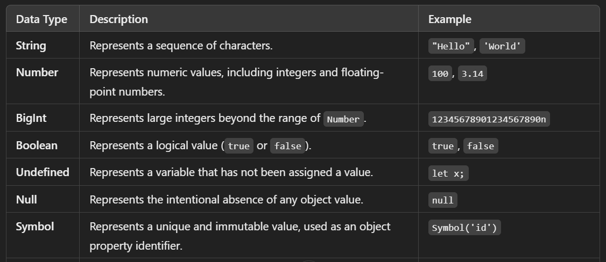
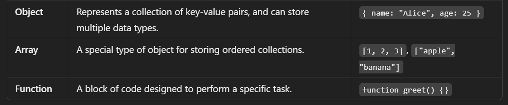

# DataType : 
- used to store or manipulate the data.

## we have two types of data.
- primitive datatype.
- non-primitive datatype.

### primitive datatype :


### non-primitive datatype :


```
//  Primitive

//  7 types : String, Number, Boolearn, null, undefined, Symbol, BigInt

const score = 100
const scoreValue = 100.3

const isLoggedIn = false
const outsideTemp = null
let userEmail;

const id = Symbol('123')
const anotherId = Symbol('123')

console.log(id === anotherId);

// const bigNumber = 3456543576654356754n


// Reference (Non primitive)

// Array, Objects, Functions

const heros = ["shaktiman", "naagraj", "doga"];
let myObj = {
    name: "hitesh",
    age: 22,
}

const myFunction = function(){
    console.log("Hello world");
}

console.log(typeof anotherId);

// https://262.ecma-international.org/5.1/#sec-11.4.3
```
