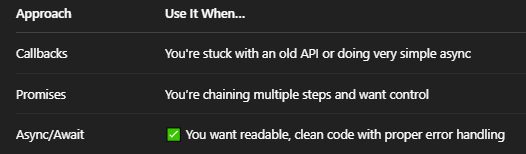

# Async code :
- To write non-blocking code, which is especially important for things like fetching data from an API, handling timers, or working with files in Node.js.

## Why Use Async Code ?
- JavaScript is single-threaded, so if you run something slow (like an API call or reading a file), it'll block everything unless you run it asynchronously.

## 3 ways to write Async code :
- Callback function (old school).

- Promises.

- Await (modern + cleanest).

### Callback function :
```
function getData(callback) {
  setTimeout(() => {
    callback("Here is your data!");
  }, 1000);
}

getData((data) => {
  console.log(data); // → "Here is your data!" (after 1 second)
});
```

### Promises :
```
function getData() {
  return new Promise((resolve, reject) => {
    setTimeout(() => {
      resolve("Data loaded!");
    }, 1000);
  });
}

getData().then(data => {
  console.log(data); // → "Data loaded!"
});
```

### Real World Example :
```
async function getUser() {

  try {
    const response = await fetch("https://jsonplaceholder.typicode.com/users/1");
    const user = await response.json();
    console.log(user);
  } 
  catch (error) {
    console.error("Error fetching user:", error);
  }
}

getUser();

// fetch() returns a promise.

// await pauses execution inside the function until it’s done.

// Wrapped in try/catch to handle errors.
```

## Which approach is better ?
## Ans :
- Async Await is better.

## Why ?
### 🔸 Callbacks :
- ✅ Still used in older APIs and event handling.

- ❌ Gets messy with nested code ("callback hell").

- ❌ Harder to manage errors cleanly.

### 🔸 Promises :
- ✅ Cleaner than callbacks.

- ✅ Good for chaining tasks (.then().catch()).

- ❌ Can still get a bit messy with complex logic.

### 🔸 Async/Await :
- ✅ Most readable & maintainable.

- ✅ Try/catch makes error handling easier.

- ✅ Looks like synchronous code, but it’s async.

- ✅ Works with any promise-based API (like fetch).

## Use Case :


## Note :
- If you're starting something new: go with async/await.