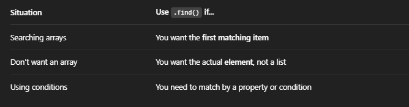
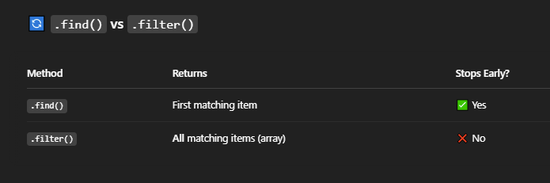
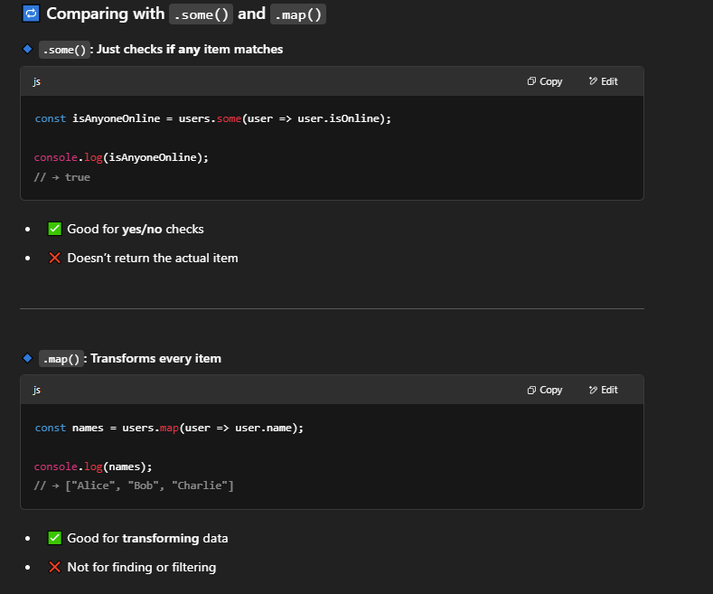
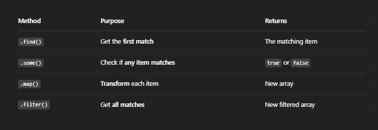

# Find() :
- it is used to search for the first element that matches a certain condition.

## Why We Use Find() ?
- Because sometimes you don’t want all the matches — you just want the first one that fits your criteria.

## 🔸 Syntax :
``` 
arrayName.find(callback)

// callback is a function that returns true for the element you're looking for.

// .find() stops searching as soon as it finds a match.

// If nothing is found, it returns undefined.
```

### Example :
```
const users = [
  { id: 1, name: "Alice" },
  { id: 2, name: "Bob" },
  { id: 3, name: "Charlie" }
];

const user = users.find(u => u.id === 2);

console.log(user); 
// Output → { id: 2, name: "Bob" }

// Here, .find() returns only the first user with id === 2.
```

## Use Case :






