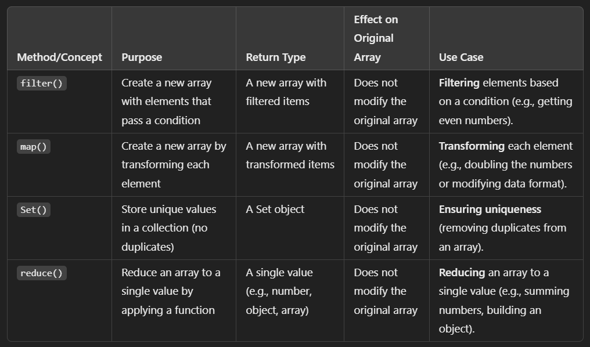

# filter(), map(), Set(), and reduce() :
- These are all commonly used methods and data structures for handling arrays and collections, but they serve different purposes and have distinct behaviors.

## filter() :
- The filter() method creates a new array containing only the elements that pass a test provided by a callback function.
- Returns: A new array with elements that satisfy a condition.
- it Does not modify the original array.

### syntax :
```
array.filter(callback(currentValue, index, array))
```

## usecase :
- Filtering elements based on a condition (e.g., getting only even numbers from an array).

### Example :
```
const numbers = [1, 2, 3, 4, 5, 6];
const evenNumbers = numbers.filter(num => num % 2 === 0);
console.log(evenNumbers);  // Output: [2, 4, 6]
```

## map() :
- The map() method creates a new array by applying a provided function to each element of the original array.

- Returns: A new array where each element is the result of applying the function to the corresponding element of the original array.
- Does not modify the original array.

### syntax :
```
array.map(callback(currentValue, index, array))
```

## usecase :
- Transforming each element of an array (e.g., doubling the values or modifying the format of the data).

### Example :
```
const numbers = [1, 2, 3, 4, 5];
const doubledNumbers = numbers.map(num => num * 2);
console.log(doubledNumbers);  // Output: [2, 4, 6, 8, 10]
```

## set() :
- A Set is a built-in JavaScript object that stores unique values of any type, whether primitive values or object references.

- Returns: A Set object that stores unique values.
- Does not allow duplicate values. It automatically removes any duplicates.
- Does not guarantee order of the elements.

### syntax :
```
let mySet = new Set([iterable]);
```

## usecase :
- Ensuring uniqueness in a collection (e.g., removing duplicates from an array).

### Example :
```
const numbers = [1, 2, 2, 3, 4, 5, 5];
const uniqueNumbers = new Set(numbers);
console.log(uniqueNumbers);  // Output: Set {1, 2, 3, 4, 5}
```

## reduce() :
- The reduce() method applies a reducer function on each element of the array (from left to right) to reduce it to a single value (e.g., a sum, product, object, etc.).

- Returns: A single value, which could be any type (array, number, string, object, etc.).
- It takes two parameters: the reducer function and an optional initial value.

### syntax :
```
array.reduce(callback(accumulator, currentValue, index, array), initialValue)
```
### Note :
- accumulator: The accumulated value (result of the previous callback).
- currentValue: The current element being processed.
- initialValue (optional): The value to start accumulating from (if not provided, the first element is used).

## usecase :
- Reducing an array to a single value (e.g., summing elements, finding a maximum, creating an object, etc.).

### Example :
```
const numbers = [1, 2, 3, 4, 5];
const sum = numbers.reduce((acc, num) => acc + num, 0);
console.log(sum);  // Output: 15
```

## Question : remove duplicate values from an array and get even numbers from that array and multiply by 2 then calculate the sum of that number?
## Answer :
```
const numbers = [1, 2, 3, 4, 5, 6, 7, 8, 9, 10, 10, 9, 8];

// Remove duplicates, filter even numbers, double them, and then calculate the sum
const sumOfDoubledEvens = [...new Set(numbers)]   // Remove duplicates
  .filter(num => num % 2 === 0)                   // Filter even numbers
  .map(num => num * 2)                             // Double each even number
  .reduce((acc, num) => acc + num, 0);            // Calculate the sum

console.log(sumOfDoubledEvens);  // Output: 60
```
- new Set(numbers) removes the duplicates from the array.
- filter() filters out the even numbers.
- map() doubles each even number.
- reduce() calculates the sum of the doubled numbers.


## conclusion :
- filter() is used for filtering elements based on a condition.
- map() is used for transforming the elements of an array.
- Set() is used to store unique values and remove duplicates.
- reduce() is used to accumulate the elements of an array into a single value (e.g., sum, object, etc.)