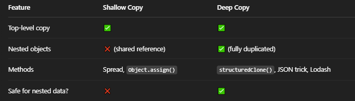

# Shallow copy :
- in shallow copy it copies the object.
- A shallow copy means that only the top-level properties are copied. If any of those properties are objects, they are still shared between the original and the copy.

##  Ways to Make a Shallow Copy :
- Object.assign({}, original)

- Spread operator: { ...original } or [...original]

### Example :
```
let original = {
  name: "Alice",
  hobbies: ["reading", "coding"]
};

let shallow = { ...original };
shallow.hobbies[0] = "gaming";

console.log("Original:", original);
console.log("Shallow:", shallow);

```
### Output
```
Original: { name: 'Alice', hobbies: [ 'gaming', 'coding' ] }
Shallow: { name: 'Alice', hobbies: [ 'gaming', 'coding' ] }
```

#  Deep Copy :
- in deep copy it copies refference.
- A deep copy means everything is copied, including nested objects and arrays.

## Ways to Make a Deep Copy :
- Using structuredClone() (modern and recommended)

- Using JSON.parse(JSON.stringify(...)) (older, but still common)

- Using libraries like Lodash (_.cloneDeep())

### Example :
```
let original = {
  name: "Alice",
  hobbies: ["reading", "coding"]
};

let deep = structuredClone(original);
deep.hobbies[0] = "gaming";

console.log("Original:", original);
console.log("Deep:", deep);

```
### Output :
```
Original: { name: 'Alice', hobbies: [ 'reading', 'coding' ] }
Deep: { name: 'Alice', hobbies: [ 'gaming', 'coding' ] }
```

